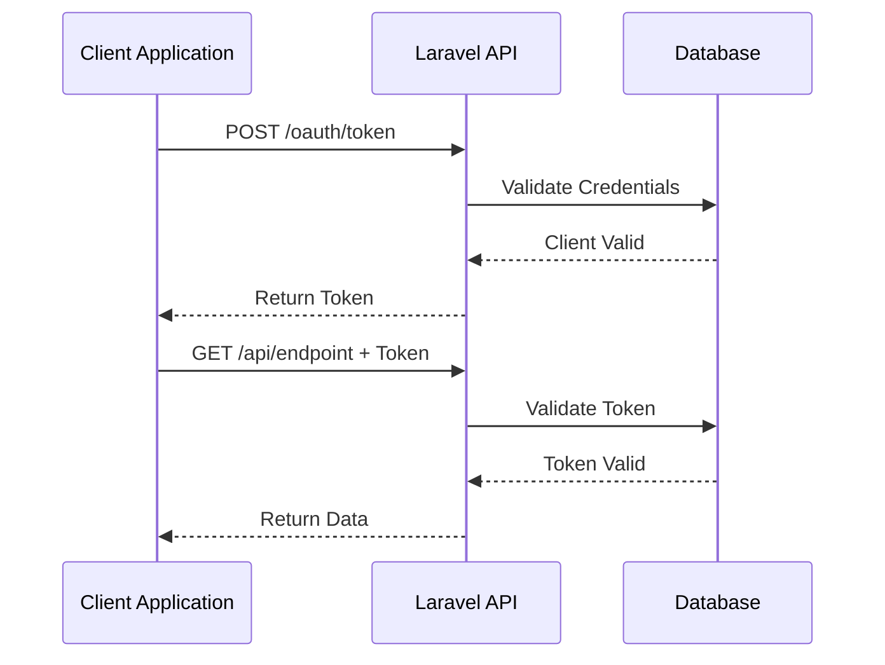
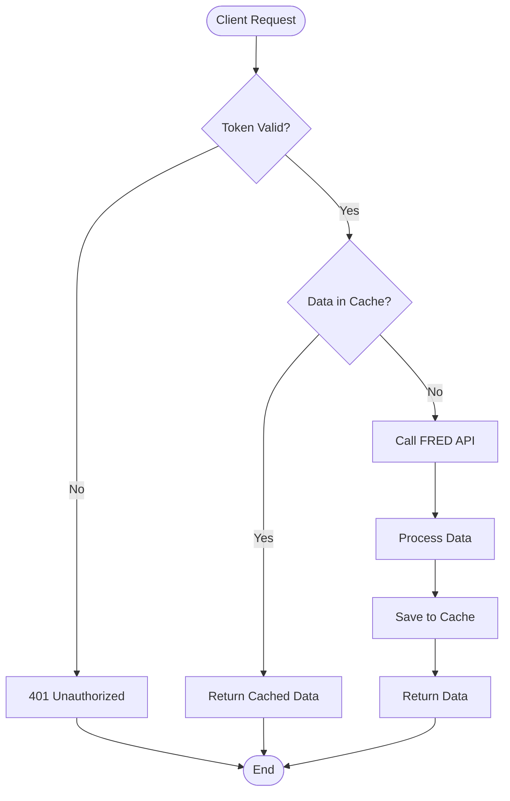
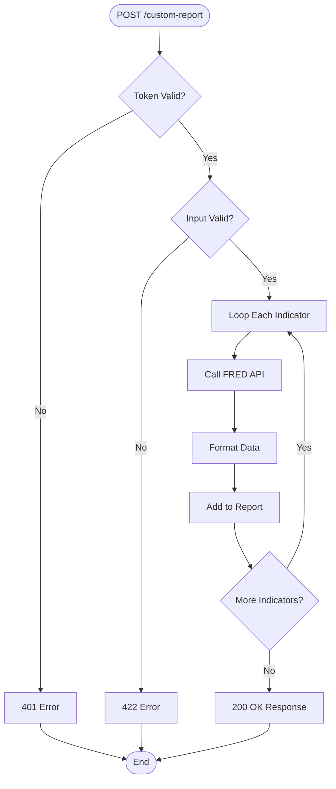
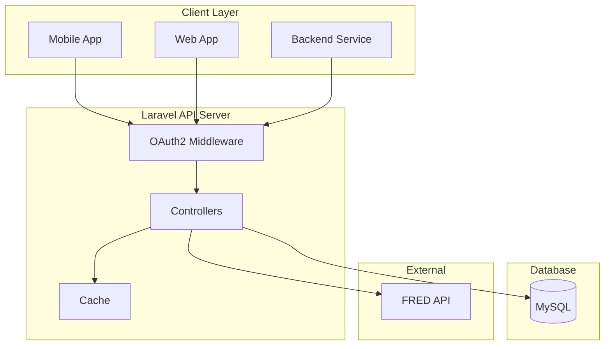

# Dokumentasi Flow - Economic Data API

Dokumentasi lengkap mengenai alur kerja, arsitektur sistem, dan flow diagram dari Economic Data API.

---

## 1. Authentication Flow


Diagram ini menggambarkan alur autentikasi antara aplikasi client, API server berbasis Laravel, dan Database.  
**Penjelasan langkah:**
- Client mengirim permintaan POST ke `/oauth/token` beserta kredensial login.
- API meneruskan permintaan ke Database untuk validasi kredensial.
- Jika valid, Database membalas konfirmasi ke API.
- API mengembalikan token autentikasi ke client.
- Setelah autentikasi, setiap permintaan ke endpoint API harus menyertakan token tersebut.
- API akan memvalidasi token ke Database sebelum memberikan respon ke client.
---

## 2. API Request Flow


Diagram ini menjelaskan proses permintaan data dari client ke API:
- Permintaan client masuk dan dicek validitas tokennya.
- Jika token tidak valid, API mengembalikan 401 Unauthorized.
- Jika token valid, dicek apakah data yang diminta sudah tersimpan di cache.
  - Jika ada, data dari cache langsung dikirim ke client.
  - Jika tidak, API akan meminta data ke FRED API eksternal, memproses dan menyimpan ke cache, kemudian mengirimkan hasil ke client.

---

## 3. Custom Report Flow


Diagram ini menjabarkan proses pembuatan custom report:
- Client mengirim request POST ke `/api/custom-report` dengan indikator yang diinginkan.
- Token diverifikasi terlebih dahulu.
  - Jika tidak valid, dikembalikan error 401.
- Data input divalidasi.
  - Jika tidak valid, dikembalikan error 422.
- Untuk setiap indikator:
  - API akan mengambil data dari FRED API.
  - Data diformat dan ditambahkan ke report.
- Jika semua indikator selesai diproses, respon 200 OK beserta report dikembalikan ke client.
---

## 4. System Architecture


Diagram ini menunjukkan arsitektur sistem secara umum:
- Berbagai jenis client (Mobile App, Web App, Backend Service) terkoneksi ke API server.
- API server dilapisi OAuth2 Middleware untuk autentikasi, dengan controller sebagai inti proses logika bisnis.
- Data dapat berasal/mengalir ke cache, MySQL database, serta sumber eksternal (FRED API).
- Dengan desain ini, sistem mendukung keamanan (autentikasi dan middleware), kecepatan (cache), serta fleksibilitas dalam mengambil data baik lokal (MySQL) maupun eksternal (FRED API).
---

## 5. API Endpoints

| Method | Endpoint                                  | Description            | Auth |
| ------ | ----------------------------------------- | ---------------------- | ---- |
| POST   | `/oauth/token`                            | Get access token       | No   |
| GET    | `/api/economic-indicators`                | Economic indicators    | Yes  |
| GET    | `/api/interest-rates`                     | Interest rates         | Yes  |
| GET    | `/api/market-indicators`                  | Market indicators      | Yes  |
| GET    | `/api/custom-report/available-indicators` | Available indicators   | Yes  |
| POST   | `/api/custom-report`                      | Generate custom report | Yes  |

---

## 6. Success Response Example

```json
{
    "success": true,
    "message": "Data retrieved successfully",
    "data": {
        "category": "Economic Indicators",
        "timestamp": "2025-12-10T04:00:00Z",
        "data": [
            {
                "indicator": "Gdp",
                "value": 30485.729,
                "date": "2025-04-01"
            }
        ]
    }
}
```

---

## 7. Error Response Examples

### 401 Unauthorized

```json
{
    "message": "Unauthenticated."
}
```

### 422 Validation Error

```json
{
    "success": false,
    "message": "Validation error",
    "errors": {
        "indicators": ["The indicators field is required"]
    }
}
```

---

## 8. Security Features

-   ✅ OAuth2 Client Credentials Grant
-   ✅ JWT Token with expiry
-   ✅ Custom middleware validation
-   ✅ Token revocation support
-   ✅ HTTPS recommended

---

## 9. Caching Strategy

| Aspect     | Detail                   |
| ---------- | ------------------------ |
| Duration   | 1 hour (3600 seconds)    |
| Key Format | `{category}_{series_id}` |
| Driver     | File or Redis            |
| TTL        | Auto expire after 1 hour |

---

## 10. Error Handling

| HTTP Code | Meaning          | Example               |
| --------- | ---------------- | --------------------- |
| 200       | Success          | Data retrieved        |
| 401       | Unauthorized     | Invalid/expired token |
| 422       | Validation Error | Invalid input         |
| 500       | Server Error     | FRED API error        |
